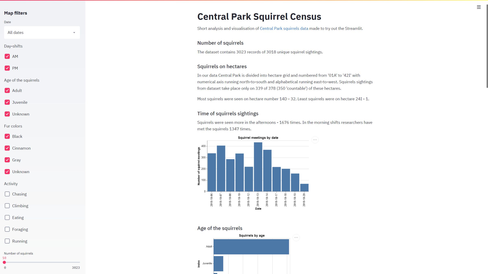
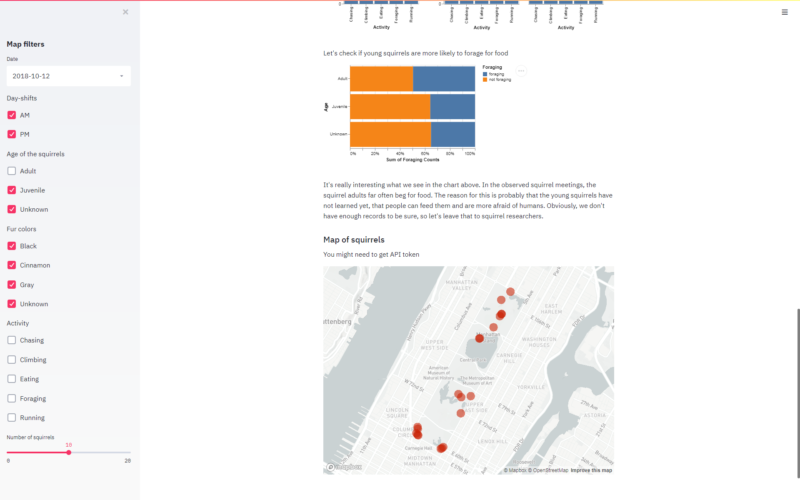

# ny_squirrels

In October 2018 the Squirrel Census recorded every squirrel seen in Central Park by 300+ volunteers.
The report of their findings is available on [The Squirrel Census][1] for $75. Now they have made the
data available through [New York City's open data portal][2]. The data includes each squirrel color, 
location, behaviour and more.


This repository contains simple application made with [Streamlit][3]. Inside there is a short analysis 
and visualisation of part of the NY squirrels dataset. On the bottom there is also a map
showing the location of encountered squirrels. There is a possibility to filter the map
using the filters on the left. 

The application was made to try out Streamlit.





There is also a map showing the encounters:


## Run
* Clone the repository:
```bash
git clone git@github.com:filusn/ny_squirrels.git
```
* cd into ny_squirrels
```bash
cd ny_squirrels
```
* (optional) Create a virtual environment; for example:
```bash
python -m venv venv_squirrels
venv_squirrels\Scripts\activate
```
* Install the dependencies:
```bash
python -m pip install -r requirements.txt
```
* Run the app:
```shell
streamlit run app.py
```

If map does not show up, you need to obtain an access token [here][4].


[1]: https://www.thesquirrelcensus "The Squirrel Census"
[2]: https://data.cityofnewyork.us/Environment/2018-Central-Park-Squirrel-Census-Squirrel-Data/vfnx-vebw "New York City's open data portal"
[3]: https://streamlit.io "Streamlit"
[4]: https://docs.mapbox.com/help/how-mapbox-works/access-tokens/